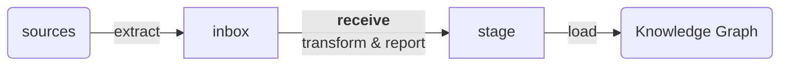

# n4o-graph-import

**This is currently being rewritten into <https://github.com/nfdi4objects/n4o-graph-importer>***

> Import into the NFDI4Objects Knowledge Graph (N4O KG)

This repository contains scripts to receive, validate, clean, transform, and import data into the [NFDI4Objects Knowledge Graph](https://graph.nfdi4objects.net/).

Eventually this is an ETL process (extract, transform, load). See directory [inbox](inbox) and [stage](stage) for details.

## Table of Contents

- [Requirements](#requirements)
  - [System requirements](#system-requirements)
  - [Data requirements](#data-requirements)
- [Installation](#installation)
- [Usage](#usage)
  - [Datenannahme und Prüfung](#datenannahme-und-prüfung)
  - [Import von Forschungsdaten](#import-von-forschungsdaten)
  - [Import von Vokabularen](#import-von-vokabularen)
<!-- [Development](#development) -->
- [License](#license)

## Requirements

### System requirements

Requires an **RDF triple store**, accessible via SPARQL Update and SPARQL Graph Store HTTP protocol. The triple store must further be configured to use the union of all named graphs as default graph. See [n4o-fuseki](https://github.com/nfdi4objects/n4o-fuseki) for a Fuseki triple store configured as needed.

Requires access to the lists of collections and vocabularies.

Technical setup for the scripts in this repository is a bit unsteady. See and
use [`Makefile`](Makefile) and [installation](#installation) for details.

### Data requirements

Bei den Daten handelt es sich zum einen um Lieferungen von Forschungsdaten und
zum anderen um Ontologien und andere Vokabulare. Forschungsdaten müssen in
LIDO-XML oder in RDF vorliegen.

Alle zu importierenden Forschungsdaten müssen genau einer "Sammlung" zugeordnet
sein. Eine Sammlung im Sinne des Import ist eine Menge von Daten in LIDO oder
RDF, die als ganzes importiert und aktualisiert werden kann. Zusätzlich müssen
Sammlungen einem übergreifenden Forschungsdaten-Repository
zugeordnet sein. Die Verwaltung von Sammlungen geschieht derzeit über
das git-Repository [n4o-databases].

Weitere Anforderungen an Datenlieferungen sind [im Handbuch des N4O
Graph](https://nfdi4objects.github.io/n4o-graph/sources.html) beschrieben.

Alle offiziell unterstützen Terminologien (Normdateien und Ontologien) sind
ebenfalls im Repository [n4o-terminologies] aufgeführt. Sie werden gesondert in den
Knowledge Graphen eingespielt.

[n4o-databases]: https://github.com/nfdi4objects/n4o-databases/
[n4o-terminologies]: https://github.com/nfdi4objects/n4o-terminologies/

### Datenannahme und Prüfung

Die **Datenannahme und Prüfung** beinhaltet:

1. Die eindeutige Zuordnung von gelieferten Dateien zu definierten Sammlungen
2. Die syntaktische Prüfung der Daten (wohlgeformtes XML bzw. RDF)
3. Im Falle von XML-Daten die Validierung gegen das LIDO-XML-Format
4. Im Falle von RDF-Daten das Aussortieren von doppelten Tripeln, Tripeln mit relativen URIs und Tripeln, die  Aussagen über die zentral verwalteten Vokabulare machen
5. Erstellung von Statistiken und Übersichten verwendeter RDF-Properties und Namensräume bzw. von verwendeten XML-Elementen zur Einschätzung der Nutzbarkeit der Daten

**Beispiele:** (könnten ins Handbuch verschoben werden)

- Die Datenbank *Objekte im Netz* enthält mehrere Teil-Sammlungen, die einzeln 
  übernommen werden, beispielsweise die Musikinstrumente-Sammlung (Sammlungs-ID 4). 

- Das virtuelle Münzportal KENOM ist eine Forschungsdatenbank deren Inhalt
  als ganzes übernommen wird (Sammlungs-ID 7).

- Der Datensatz *Ogham Data* wurde unabhängig von einer Forschungsdatenbank im
  allgemeinen Repository Zenodo unter der DOI <https://doi.org/10.5281/zenodo.4765603>
  publiziert (Sammlungs-ID 9) und wird einzeln übernommen.

#### receive

Zur Durchführung der Datenannahme muss eine Lieferung in Form einer Datei irgendwo im lokalen Dateisystem vorliegen. Es empfiehlt sich, die Datei im Verzeichnis `inbox` abzulegen, damit sie bei Bedarf für weitere Prüfungen zur Verfügung gestellt werden kann. Das Skript [`receive`](receive) erwartet eine vorab definierte Sammlungs-ID und die entsprechende RDF/Turtle- oder LIDO-XML-Datei.

Die empfangenen RDF- bzw. LIDO-Daten werden syntaktisch geprüft und rudimentär
bereinigt in einem Unterverzeichnis von [`stage`](stage) mit der jeweiligen
Sammlungs-ID abgelegt. Das betreffende Import-Verzeichnis enthält verschiedene
Report-Dateien mit Statistiken und im Erfolgsfall die Datei `filtered.nt` für
geprüfte und bereinigte RDF-Daten bzw. die Datei `valid.xml` für geprüfte
LIDO-Daten.

Darüber hinaus wird für RDF-Daten eine Statistik der verwendeten RDF-Properties
und der RDF-Namensräume von Subjekt- und Objekt-URIs erstellt. Letztere werden
mit bekannten Namensräumen abgeglichen (siehe [n4o-terminologies]).

#### Datenannahme von Zenodo

Download a publication from Zenodo into inbox directory and unpack its RDF data:

~~~sh
./extract-zenodo https://doi.org/10.5281/zenodo.5642751
~~~

Inbox directory is named after the Zenodo identifier (part of the DOI).

Internally this is two steps:

- `./download-zenodo https://doi.org/10.5281/zenodo.5642751`
- `./unpack-zenodo-rdf.py inbox/zenodo-5642751`

The result is three files:

- `files-archive.zip` - full data from Zenodo
- `metadata.json` and `metadata.rdf` - metadata about the publication
- `triples.nt` - extracted RDF data

#### Annahme der RDF-Datei

~~~sh
./receive 10 inbox/zenodo-5642751/triples.nt
~~~

### Import von Forschungsdaten

Das Einspielen der bereinigten RDF-Daten als Named Graph in einen lokalen Fuseki RDF-Triple-Store bzw. das Konvertieren der LIDO-XML-Daten zur Einspielung in den gemeinsamen Knowledge Graphen erfolgt mit folgenden Skripten.

#### Einspielen von LIDO-Daten

*Noch in Arbeit*

#### Wikidata

Im Verzeichnis `wikidata` werden RDF-Daten aus Wikidata vorgehalten und können mit `load-wikidata` in den Triple-Store geladen werden.

Das Skript `extract-wikidata` ermittelt Wikidata-Entity-IDs aus der Liste von Datenbanken und läd diese von Wikidata.

~~~sh
./extract-wikidata
./load-wikidata
~~~

## License

MIT License
